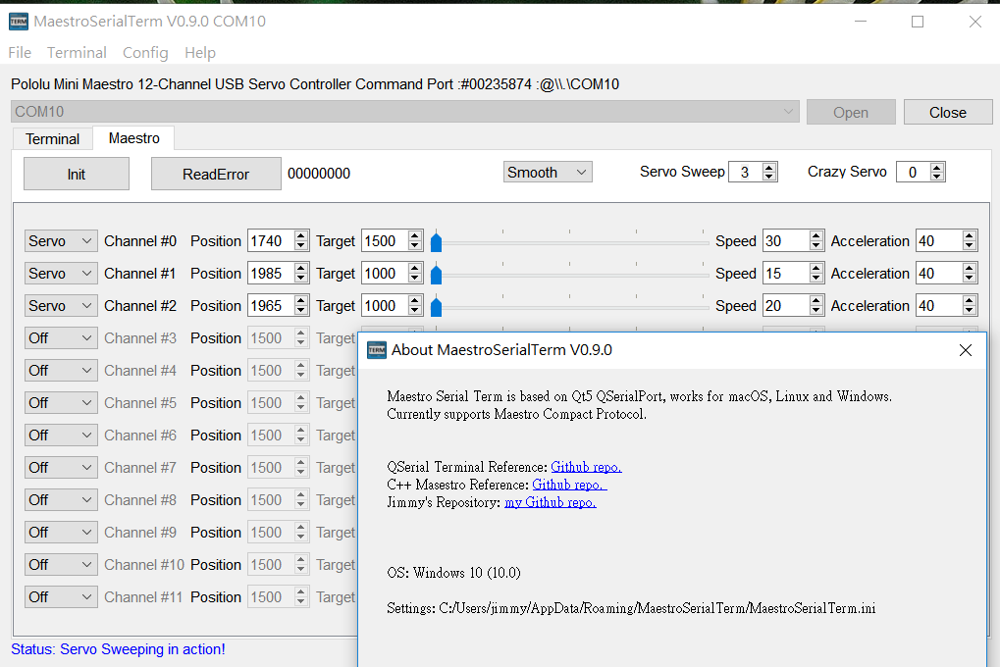
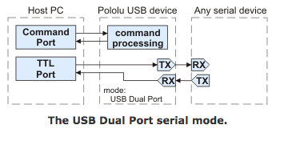

# PololuMaestro
**QT5** for PololuMaestro Servo Control, works on **macOS** high sierra, **Lubuntu** 18.04 and **Windows10**
   
   
  
 
### References
  - [Maestro Serial Settings](https://www.pololu.com/docs/0J40/5.a)
  - [Maestro Serial Protocol](https://www.pololu.com/docs/0J40/5.c)
  - [Maestro Firmware Upgrade](https://www.pololu.com/docs/0J40/4.f)
  - [Inverse kinematics: How to move a robotic arm](https://appliedgo.net/roboticarm/)
   
   
  
### for MAC:
1)Upgrage firmware to __V1.03__ 
  
2)Config firmware setting with __USB Dual Port__ 

### Change Logs:
  - 0312 Add servo sweeping video
  - 0312 Update Qt5 project V0.9.0
  - 0313 Update V0.9.1, add min/max control for Servo/Input/Output channel options
  - 0315 Update V0.9.2, add Input Position timer, fix settings restore.
  
  - ~~TODO: Input display w/ timer~~
  
